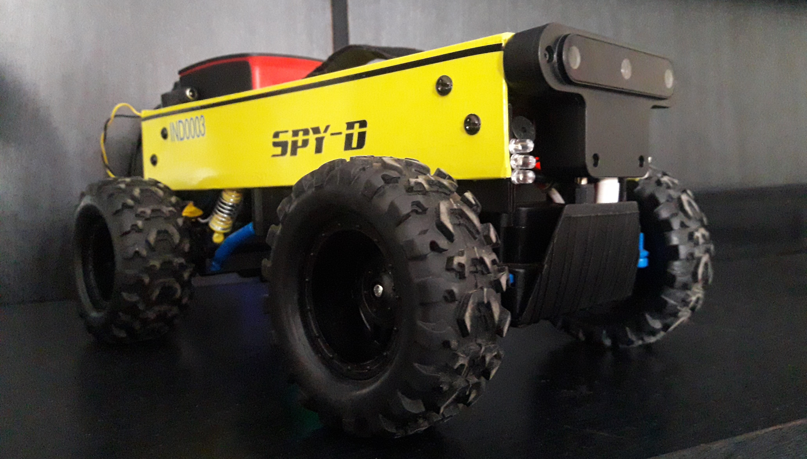

# SPY-D

**i turned my old toy car into a POWERFUL Robot.**

  

and this car, my codes will work on all the devices such as jetson nano, pis, pandas, and os like windows, ubuntu, ros etc.. with the same code..  
python makes it easy, with the help of pyserial lib.

simply just need to build the car, wireup as shown below,  pip install pyserial and some libs and plug in device usb to arduino .. and game is on.

**components im using**

   [ 1. MDF board](https://www.flipkart.com/whittlewud-pack-10-blank-wood-mdf-board-mdf-chipboard-sheets-crafts-arts-laser-cutting-8in-x-size-each-pieces-pine-veneer/p/itmed0d953027b82?pid=WVRGY9VQFENWZP6S&lid=LSTWVRGY9VQFENWZP6SL9F3WE&marketplace=FLIPKART&cmpid=content_wood-veneer_8965229628_gmc)\
   [2. 24 1"L camps ](https://www.indiamart.com/proddetail/l-shape-clamp-partition-clamp-20823807291.html)\
   [3. male, female header pins](https://www.amazon.in/Component-General-Purpose-Printed-Circuit/dp/B08GJ8YL2S/ref=sr_1_2?crid=29Q45MKJKWWBL&dchild=1&keywords=pcb+boards&qid=1619415738&s=industrial&sprefix=pcb+board%2Cindustrial%2C293&sr=1-2)\
   [4. prototype PCB ](https://www.amazon.in/Component-General-Purpose-Printed-Circuit/dp/B08GJ8YL2S/ref=sr_1_2?crid=29Q45MKJKWWBL&dchild=1&keywords=pcb+boards&qid=1619415738&s=industrial&sprefix=pcb+board%2Cindustrial%2C293&sr=1-2)\
   [5. 4007 diodes](https://www.amazon.in/Genuine-100pcs-1N4007-Rectifier-compliant/dp/B0773LVGDH/ref=sr_1_1?crid=343HFILKT9RVI&dchild=1&keywords=4007+diode+rectifier&qid=1619415810&sprefix=4007%2Cindustrial%2C289&sr=8-1)\
   [6. ceramic capacitors for motors](https://www.amazon.in/Pics-Volt-Ceramic-Disc-Capacitor/dp/B08DG4ZZD1/ref=sr_1_2?crid=2RS6UWX7KJ441&dchild=1&keywords=ceramic+capacitor&qid=1619415842&sprefix=ceramic+ca%2Caps%2C299&sr=8-2)\
   [7. screw terminal wire connectors](https://www.amazon.in/INVENTO-5-5x2-1mm-Terminal-Connector-Connections/dp/B07TBPKR67/ref=sr_1_5?crid=20MNNPNJJHJQ1&dchild=1&keywords=screw+terminal+connector&qid=1619415871&sprefix=screw+termi%2Caps%2C295&sr=8-5)\
   [8. 1k resistors](https://www.amazon.in/ELECTROBOT-100-PCS-1K-OHM/dp/B072HC6ZYW/ref=sr_1_1?crid=29TWQRJTKX6Y9&dchild=1&keywords=1k+resistor&qid=1619415902&sprefix=1k+res%2Caps%2C304&sr=8-1)\
   [9. OAK-D stereo AI cam](https://store.opencv.ai/products/oak-d)\
   [10. jumper wires](https://www.amazon.in/Synthan-Electronics-Jumper-Wires-Male_/dp/B08SMF7VSB/ref=sr_1_1_sspa?crid=3AH5XCKQSA3O8&dchild=1&keywords=jumper+wires&qid=1619416028&sprefix=jumper+%2Caps%2C320&sr=8-1-spons&psc=1&spLa=ZW5jcnlwdGVkUXVhbGlmaWVyPUEyS01DVjJaMVRPVzhZJmVuY3J5cHRlZElkPUEwMzg5NjQzM0pKOE1WMEc2UUhHWCZlbmNyeXB0ZWRBZElkPUEwODU4OTAwMlRUQlFFRklEVDlIWCZ3aWRnZXROYW1lPXNwX2F0ZiZhY3Rpb249Y2xpY2tSZWRpcmVjdCZkb05vdExvZ0NsaWNrPXRydWU=)\
   [11. DC-DC buck converter](https://www.amazon.in/LM2596-DC-DC-Buck-Converter-Module/dp/B009P04YTO/ref=sr_1_2?crid=237AMBAFNE0BE&dchild=1&keywords=buck+converter&qid=1619416063&sprefix=buck+%2Caps%2C304&sr=8-2)\
   [12. some zip ties](https://www.amazon.in/Globomotive-Premium-Nylon-Locking-Pieces/dp/B08GKPWLB9/ref=sr_1_1_sspa?crid=2HID9Y6L9P7QH&dchild=1&keywords=zip+ties&qid=1619416138&sprefix=zip+%2Caps%2C303&sr=8-1-spons&psc=1&spLa=ZW5jcnlwdGVkUXVhbGlmaWVyPUExQlZZVVo1WkRHVkdTJmVuY3J5cHRlZElkPUEwNDM3Nzc1M0RTTEozVlBZTExRUSZlbmNyeXB0ZWRBZElkPUEwMDk1OTg4M0cyMzVBNVNBNVlIUiZ3aWRnZXROYW1lPXNwX2F0ZiZhY3Rpb249Y2xpY2tSZWRpcmVjdCZkb05vdExvZ0NsaWNrPXRydWU=)\
   [13. slide switch](https://www.amazon.in/ABDKart-Plastic-Switch-Mounting-Position/dp/B089Y89V6X/ref=sr_1_10?crid=1OCE4HP3HADDM&dchild=1&keywords=slide+switch&qid=1619416173&sprefix=slide+switch%2Caps%2C303&sr=8-10)\
   [14. LEDs](https://www.amazon.in/SHOPEE-BRANDED-Pack-Basic-Ultimatum-Pieces-Colours/dp/B078SXG6XZ/ref=sr_1_7?crid=2IMWLL7S73VO&dchild=1&keywords=leds&qid=1619416329&sprefix=leds%2Caps%2C311&sr=8-7)\
   [15. L298N motor driver](https://www.amazon.in/Robodo-Electronics-Motor-Driver-Module/dp/B00N4KWYDE/ref=sr_1_1?crid=I8ZCJ9ILM5OF&dchild=1&keywords=l298n+motor+driver+module&qid=1619416372&sprefix=l298n%2Caps%2C292&sr=8-1)\
   [16. 24 sets , screws and bolts](https://robu.in/product/easymech-m4-x-40mm-chhd-bolt-nut-and-washer-set-15-pcs/?gclid=EAIaIQobChMI7J27n5yb8AIVQlpgCh35hQSUEAYYASABEgKO6fD_BwE)\
   [17. RC car (scale 1:10)](https://upbey.com/rc-car-x-03-24g-1-10-4wd-brushless-high-speed-60km-h-big-foot-vehicle-models-truck-off-road-vehicle-buggy-rc-electronic-toys-rtr-red-p5182.html)\
   [18. 5v buzzer](https://www.amazon.in/Passive-Acoustic-Component-Speaker-electronic/dp/B07MR2KN97/ref=sr_1_4?crid=29LGL5MWNHYP&dchild=1&keywords=buzzer&qid=1619416547&sprefix=buzzer%2Caps%2C316&sr=8-4)\
   [19. white leds](https://www.amazon.in/Flame-Clear-White-Emitting-100Pcs/dp/B015472K9M/ref=sr_1_6?crid=POD1NV6BN3J9&dchild=1&keywords=white+led&qid=1619416573&sprefix=white+led%2Caps%2C300&sr=8-6)\
   [20. batteries 6x 18650](https://www.amazon.in/Battery-Rechargeable-Bluetooth-Speaker-2600mAh/dp/B08NQ622LF/ref=pd_sbs_1?pd_rd_w=Mgc8o&pf_rd_p=18688541-e961-44b9-b86a-bd9b8fa83027&pf_rd_r=MH692RF8M6VEPMWGAECH&pd_rd_r=65156690-a336-47cd-9eab-1c46aac9a946&pd_rd_wg=SXxVi&pd_rd_i=B08NQ622LF&psc=1)\
   [21. raspberry pi](https://www.amazon.in/India-Raspberry-Official-Heatsink-Ethernet/dp/B07XSJ64ZY/ref=sr_1_9?crid=1WDFU1NG6I9WE&dchild=1&keywords=raspberry+pi+4&qid=1619416676&s=electronics&sprefix=raspberry%2Celectronics%2C313&sr=1-9) im using raspy 3b+  because i had one \
   [22. arduino nano](https://www.amazon.in/Raspberry-Pi-Model-Controller-Electronic/dp/B07XT1QJ4S/ref=sr_1_4?crid=1WDFU1NG6I9WE&dchild=1&keywords=raspberry+pi+4&qid=1619416676&s=electronics&sprefix=raspberry%2Celectronics%2C313&sr=1-4)\
   [23. usb mini-B for arduino](https://www.amazon.in/Raspberry-Pi-Model-Controller-Electronic/dp/B07XT1QJ4S/ref=sr_1_4?crid=1WDFU1NG6I9WE&dchild=1&keywords=raspberry+pi+4&qid=1619416676&s=electronics&sprefix=raspberry%2Celectronics%2C313&sr=1-4)\
   [24. usb connector for raspberry pi for power](https://www.amazon.in/India-Raspberry-Official-Heatsink-Ethernet/dp/B07XSJ64ZY/ref=sr_1_9?crid=1WDFU1NG6I9WE&dchild=1&keywords=raspberry+pi+4&qid=1619416676&s=electronics&sprefix=raspberry%2Celectronics%2C313&sr=1-9)\
   [25. usb type-C for OAK-D](https://store.opencv.ai/products/oak-d)\
   [26. BT keyboard](https://www.amazon.in/Teconica-Bluetooth-Rechargeable-Lithium-Ion-Ergonomically/dp/B07H5MMCKS/ref=sr_1_6?crid=2C98EQFFR2JZD&dchild=1&keywords=bt+keyboard&qid=1619416834&s=electronics&sprefix=bt+key%2Celectronics%2C303&sr=1-6)\
   [27. color wrapper](https://www.amazon.in/CVANU-Matte-Vinyl-Sheet-Sticker/dp/B06XFXDFMX/ref=sr_1_1?crid=112L2NBUPVFY1&dchild=1&keywords=vinyl+wrap+red+matte&qid=1619416964&replacementKeywords=vinyl+wrap+matte&sprefix=vinyl+wrap+red%2Caps%2C317&sr=8-1&vehicle=Vespa%3ARED) beacuse i found its better than a paint job.. \
   [28. wires](https://www.amazon.in/SunRobotics-Single-Breadboard-Hobbyists-Students/dp/B07SFJDF63/ref=sr_1_2?crid=1W7KWYJ0DCME1&dchild=1&keywords=single+core+wire&qid=1619417029&sprefix=single+core+wire%2Caps%2C292&sr=8-2)\
   [29. slide switch for power](https://www.amazon.in/Combo-switch-Rocker-pieces-project/dp/B08RY7B3KR/ref=sr_1_1?crid=1EOE0OHCGXI3N&dchild=1&keywords=slide+switch&qid=1619417060&sprefix=slide+sw%2Caps%2C297&sr=8-1)\
   [30. patiences.](https://assets.entrepreneur.com/content/3x2/2000/20150824181921-meditate-yoga-relax-calm-zen.jpeg?width=700&crop=2:1)

**keyboard controlled car**

setting up everything to the aspects was highly challenging...
bcoz of power // power was the limitation , and had to be played with in the limitations..
and to take control of a Car using simple Python code to bring the Car to life!
with this connection setup  had to face lot for power incompatibility.

**POWER CONSUMPTION TABLE :**

    *components*          *consumption*
    
    arduino                 0.40mA
    raspberry pi 4          600mA  (screen size 800x720)
    oak-d                   800mA  (300hX300w running mobile net infernece)
    L298n(logic)            0.36mA

all this power had to delivered through the raspberry pi //
but the RPi power source was the small power bank // may b around 1000mA 5v
which was enough only to a RPi // without any usb loads such as OAKs

while the other way , OAK-D has an another power chord.
now thought of drawing power from L298Ns 5volts to OAK-d still had to face the same power incompatibility... RPi was unable to boot.
had to use a DC-DC buck converter  drawing power directly from the 12v batteries step down to 5v. this  LM2596S module was capable upto 3A which was easy enough..

**wiring:**

    a. l298N motor driver

    IN1             >       D4
    IN2             >       D5
    ENA             >       D5
    ENB             >       D6
    IN3             >       D6
    IN3             >       D7 th pin of arduino.
    +pin            >       battery + (12v)
    GND             >       battery -
    GND             >       arduino's GND

    buzzer (+)ve  	> 	D3
    buzzer (-)ve  	> 	GND of arduino

    whiteLed (+)ve  > 	D10
    whiteLed (-)ve  > 	GND of arduino

    b. buck converter
    
    LM2596S (+)ve  	>  	battery (+) (12v)
    LM2596S (-)ve  	>  	battery (-) 
    steping down LM2596S module volts to 5.

    oak-D (+)ve  	> 	5v
    oak-D (-)ve  	> 	GND of  LM2596S module

    RPi (+)ve	> 	5v
    RPi (-)ve  	> 	GND of  LM2596S module

    c. RPi to arduino connection with USB cable
    d. OAK-D to RPi connection with a USB cable

now it was all set to run the car:

*demo*

yolov4 api

